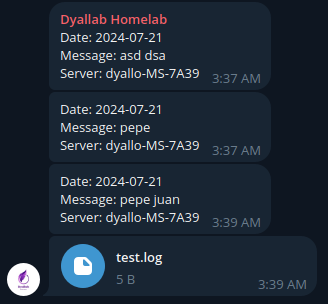

# Telelog 📩

<p align="center">
  
</p>

A simple interface to send messages or files to telegram. The purpose of this is mostly have a centralized way to send messages or files to telegram events on my servers, but since I created it, I thought it would be nice to share it with the community.



## Pre-requisites 📦

- `curl` installed.
- Telegram bot (Get it from [BotFather](https://core.telegram.org/bots#6-botfather)).
- Bot is part of a channel.

## Installation 🚀

```bash
wget https://raw.githubusercontent.com/jd-apprentice/telelog/master/lib/telelog
chmod +x telelog
mv telelog /usr/local/bin
```

## Usage 🛠

```bash
telelog

Usage: telelog [flags] [content]
Flags: 
       --message, -m: Send a message to the channel.
       --file, -f: Send a file to the channel.
       --help, -h: Show this help message.
       --set-chat_id: Set chat_id in the configuration file.
       --set-token: Set token in the configuration file.

Example: telelog --message 'Hello, World!'
Example: telelog --file /path/to/file
Example: telelog --message 'Hello, World!' --file /path/to/file
Example: telelog --set-chat_id 123456789
Example: telelog --set-token 123456789:ABC-DEF1234ghIkl-zyx57W2v1u123ew11
```

## TODO 📝

- [x] Add support for zsh, fish, etc.
- [x] Set chat_id and token in the configuration file.
- [x] Set chat_id and token from the command line.
- [ ] Add support for multiple files.
- [ ] Add support for multiple channels.
